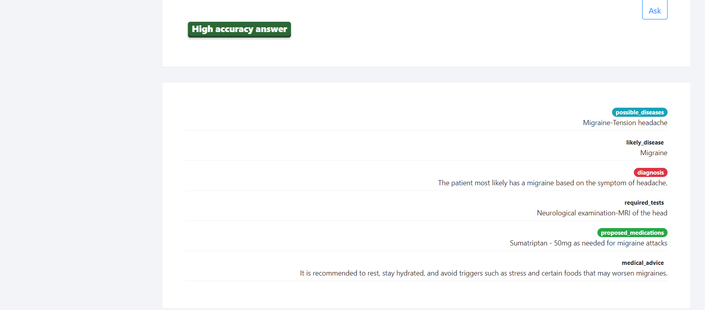
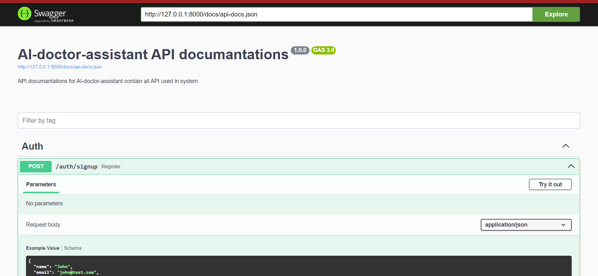
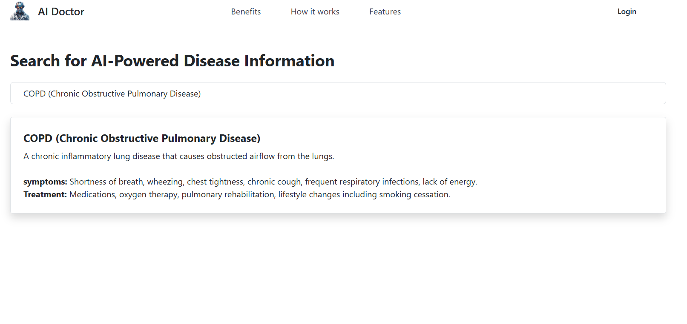
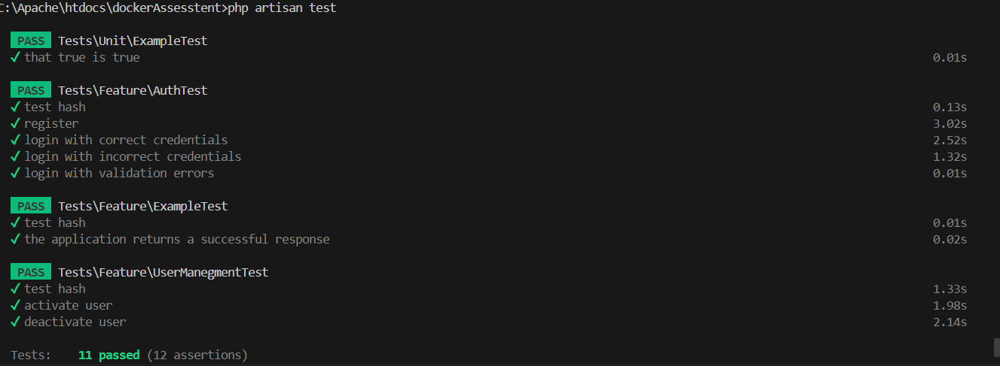

#  AI-doctor-assistant

  

# Introduction

  

The Medical Diagnosis Assistance System is a web application designed to assist doctors in diagnosing medical conditions more efficiently. It integrates various technologies, including Laravel 10, Vue.js, MySQL database, and the ChatGPT language model, to provide comprehensive support for medical diagnosis based on patient cases, medical test results, medical history, and other relevant inputs.

## Features

  

- User Authentication: Secure user authentication system with Laravel's built-in authentication features.
- Role-based Access Control: Implemented using Spatie for managing roles and permissions, ensuring that only authorized users can access certain features.
- Database Integration: MySQL database integration for storing user data, medical cases, medical test results, and other relevant information.
- ChatGPT Integration: Integration of the ChatGPT language model to analyze patient cases and provide diagnostic recommendations.
- Vue.js Frontend: Frontend interface built with Vue.js to provide a dynamic and responsive user experience.
- Medical Case Management: Allows doctors to input patient cases, medical history, symptoms, and other relevant information for analysis.
Diagnostic Recommendations: Generates diagnostic recommendations based on patient input and medical knowledge encoded in the ChatGPT model.
Dashboard: Provides doctors with an overview of ongoing cases, diagnostic history, and other relevant statistics.
## System Architecture

  

The Medical Diagnosis Assistance System follows a typical client-server architecture:

- Client-side: Built with Vue.js, providing an interactive user interface for doctors to input patient data and view diagnostic recommendations.
- Server-side: Developed with Laravel 10, serving as the backend API to handle user authentication, data storage, and integration with the ChatGPT model.
- Database: Utilizes MySQL as the relational database management system for storing user data, patient cases, diagnostic history, and other relevant information.
Installation and Setup

  

## Integration
-    The application integrates with openAI (chatGpt) 
-    The application integrates with PayPal (Payment gatway) 

## How to set up 
- composer install --no-dev
- npm install 
- npm run build 
- create .env file and copy content from .example.env
- setup database in .env file (DB_DATABASE, 
  DB_USERNAME, DB_PASSWORD)
- Assign gor environment variables __OPEN_AI_TOKEN__ your openAi api token
-  generate app key `php artisan key:generate`
-  php artisan migrate
-  php artisan db:seed
-  php artisan l5-swagger:generate
- php artisan serve --port 8089

## API Documentation 
I built API documentation using swagger also available in  this documentation:

  

### Authentication

#### Signup
- **Method:** POST
- **Endpoint:** /auth/signup
- **Parameters:**
  - `name`: Required
  - `email`: Required, Email format, Unique
  - `password`: Required
  - `phone`: Required

#### Login
- **Method:** POST
- **Endpoint:** /auth/login
- **Parameters:**
  - `email`: Required
  - `password`: Required

#### Activate User Account
- **Method:** POST
- **Endpoint:** /auth/activate
- **Permissions Required:** Manage Users
- **Parameters:**
  - `userId`: User ID to activate the account

### Payments

#### Add Points to User
- **Method:** POST
- **Endpoint:** /payments/add-points-to-user
- **Permissions Required:** Manage Users
- **Parameters:**
  - `number_of_points`
  - `cost`
  - `user_id`
  - `pay_type`
  - `point_type`

#### Granting Trial Period
- **Method:** POST
- **Endpoint:** /payments/granting-trial-period
- **Permissions Required:** Manage Users
- **Parameters:**
  - `user_id`

### User Management

#### Get User by ID
- **Method:** GET
- **Endpoint:** /auth/getUsrById/{id}
- **Permissions Required:** Manage Users or Same ID as Login User
- **Parameters:**
  - `id`: User ID

#### Get All Users
- **Method:** GET
- **Endpoint:** /auth/get-all-users
- **Permissions Required:** Manage Users

#### Get Users with Points and Packages
- **Method:** GET
- **Endpoint:** /point-management/users-with-points

### User Profile

#### Get User Profile
- **Method:** GET
- **Endpoint:** /main-page/userProfile
- **Permissions Required:** Login User

### Medical Diagnosis

#### Request AI Medical Diagnosis
- **Method:** POST
- **Endpoint:** /medical-diagnosis
- **Parameters:**
  - `oldResults`
  - `affectFactors`
  - `history`
  - `symptoms`
  - `gender`
  - `AdvancedReponse`

  ## GraphQl API
   I created __GraphQl API__ to search on common Diseases on DB search 
   
 - suggestions and search results for any selected Diseases

   

   ##  Feature & Unit Tests
  To run feature & unit  tests
> php artisan test

  
